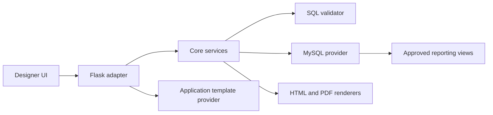

# Developer Guide

## Architecture



`slim_report_core` has no web-framework dependency. It owns report models, serialization, SQL
validation, metadata, dataset execution, parameter conversion, binding, and rendering. Adapters own
authentication, HTTP, CSRF, storage orchestration, safe errors, and cache policy. The UI is packaged
static content and does not execute SQL itself.

## Setup and quality gates

```bash
python -m pip install -e "packages/slim_report_core[dev,database]"
python -m pip install -e packages/slim_report_designer_ui
python -m pip install -e "packages/slim_report_flask[database]"
python -m pytest -q
python -m ruff check .
python scripts/check_release_security.py
python scripts/release_check.py
```

Normal CI uses fake providers. Live MySQL and browser tests are optional and must be reported as
skipped unless their environment is configured. Release scripts build and inspect artifacts but
never publish them.
